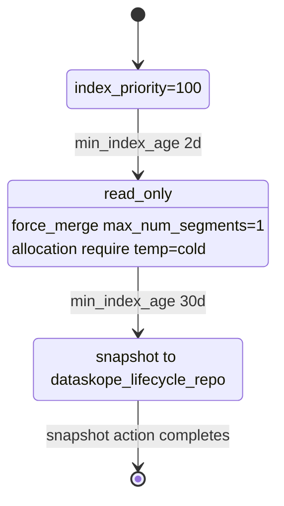

# Dataskope OpenSearch Lifecycle Management PoC

Bu PoC'de "ILM" ihtiyacinin OpenSearch karsiligi `Index State Management (ISM)` olarak ele alinir. Lifecycle katmani; hot/cold/search node kurgusu, index template, ISM policy, snapshot repository ve manage scriptlerinden olusur.

## Hedef

- Dataskope event payload semasini mumkun oldugunca koruyarak OpenSearch'e yazmak.
- Eventleri `TimeCreated` tarihine gore gunluk indexlere yazmak.
- Index adini `events_yyyy_MM_dd` formatinda standardize etmek.
- Yeni indexlerin hot node'da olustugunu gostermek.
- Hot + searchable snapshot ile eski veri arama ihtiyacini kanitlamak.
- Cold tier'i zorunlu mimari parcasi degil, opsiyonel ara optimizasyon olarak degerlendirmek.
- Hot pencere disindan gelen eski/future eventlerin yeni index acmasini engellemek.
- Policy degistiginde mevcut managed indexlerin nasil davrandigini dokumante etmek ve scriptlerle izlenebilir yapmak.
- Arama amacli arsiv ile disaster recovery backup gereksinimini birbirinden ayirmak.

## Kisa Terminoloji

- `hot`: Yazilan ve sik aranan index. PoC'de `opensearch-hot`, `node.attr.temp=hot`.
- `cold`: Artik yazilmayan, read-only, daha dusuk oncelikli searchable index. PoC'de `opensearch-cold`, `node.attr.temp=cold`.
- `frozen/searchable snapshot`: Snapshot repository uzerinden `storage_type=remote_snapshot` olarak restore edilen read-only index. PoC'de `opensearch-search`, `node.roles=search`.
- `ISM policy`: State/action/transition tanimi. OpenSearch bunu job interval geldikce calistirir; surekli akan bir daemon gibi anlik karar vermez.

## Index Modeli

Varsayilan index prefix:

```text
events
```

Gunluk concrete index formati:

```text
events_yyyy_MM_dd
```

Ornek:

```text
events_2026_04_23
```

Producer, index tarihini event'in `TimeCreated` alanindan cozer. `TimeCreated` yoksa veya parse edilemiyorsa fallback olarak uretim zamanini kullanir. `Producer:PreserveDateFields=true` oldugu icin PoC sample verisindeki tarih alanlari bugune cekilmez.

Onemli: ISM `min_index_age` index adindaki tarihe degil, index creation time'a bakar. Yani `events_2026_04_23` bugun ilk kez olusturulursa ISM acisindan yeni indextir.

Dataskope hedef mimarisinde producer bu problemi bastan engeller: `Producer:DropEventsOutsideHotWindow=true` ve `Producer:HotWindowDays=30` ile bugun dahil son 30 gun disindaki eski veya future-dated eventler OpenSearch'e yazilmaz. Veri kaybi yasamamak icin bu eventler `Producer:RejectedEventsDumpFilePath` dosyasina NDJSON dump/DLQ olarak append edilir. Dump path yoksa producer baslamaz. Boylece 3 ay onceki event yanlislikla `events_yyyy_MM_dd` eski indexi acmaz ve veri de kaybolmaz.

Backfill testleri veya migration senaryolari bu guard kapatilarak yapilmalidir. Guard kapaliysa `scripts/promote-events-by-date.ps1` hala gereklidir, cunku ISM event tarihine degil index creation time'a bakar.

## Onerilen Sade Dataskope Akisi

Cold tier zorunlu degil. Dataskope icin daha sade ana akis:

```text
ingest guard -> hot index -> read-only/force-merge -> snapshot -> searchable snapshot restore -> original index delete
```

Bu modelde:

- Hot pencere disi event ingest sirasinda ignore edilir veya dump/DLQ'ya yazilir.
- Hot pencere disi event OpenSearch'e yazilmaz ama zorunlu olarak dump/DLQ dosyasina yazilir.
- Hot pencere icindeki eventler gunluk indexlere yazilir.
- Retention dolunca snapshot alinir.
- Snapshot `remote_snapshot` olarak search/frozen node'lara acilir.
- Frozen search dogrulaninca orijinal hot index silinir.

Cold tier sadece su gerekcelerle eklenir: force-merge'i hot ingest node'undan uzaklastirma, snapshot oncesi kisa bekleme alani, veya eski verinin snapshot'a gecmeden once bir sure disk uzerinden daha dusuk latency ile aranmasi.

## Local Mimari

`docker-compose.yml` su servisleri kaldirir:

- `opensearch-hot`: cluster manager + data + ingest, hot attr.
- `opensearch-cold`: data node, cold attr.
- `opensearch-search`: searchable snapshot cache node, search role.
- `opensearch-dashboards`: UI ile Index Management ekranlarini gormek icin.
- `event-producer`: Dataskope eventlerini bulk API ile yazar.
- `opensearch-snapshot-init`: snapshot volume izinlerini OpenSearch baslamadan hazirlar.

Snapshot repository:

- OpenSearch ici path: `/mnt/snapshots`
- Repository adi: `dataskope_lifecycle_repo`

## Lifecycle Dosyalari

- `opensearch/lifecycle/dataskope-index-template.json`
  - `events_*` indexleri icin template.
  - Default olarak 3 primary shard, 0 replica, `temp=hot` allocation.
  - Temel Dataskope alanlari icin mapping.

- `opensearch/lifecycle/dataskope-ism-policy.poc.json`
  - Gunluk index policy.
  - `hot -> cold -> snapshot_ready` state akisi.
  - `hot`: priority 100, 2 gun sonra cold'a gecis.
  - `cold`: read-only, force-merge, allocation `temp=cold`, priority 50.
  - `snapshot_ready`: `dataskope_lifecycle_repo` icine snapshot alir.

- `opensearch/lifecycle/dataskope-ism-policy.long-retention.example.json`
  - Daha uzun retention ornegi.
  - Performans testlerinden sonra hot/cold/snapshot sureleri ve shard sayisi netlestirilmeli.

## State Machine



## Manage Scriptleri

Stack'i baslatmak ve lifecycle'i uygulamak:

```powershell
.\scripts\start-lifecycle-poc.ps1
```

Yeni ayarlari tekrar uygulamak:

```powershell
.\scripts\bootstrap-lifecycle.ps1
```

Durum:

```powershell
.\scripts\lifecycle-list.ps1
.\scripts\lifecycle-explain.ps1 -ShowPolicy -ValidateAction
```

Backfill/gecmis tarihli indexleri index adina gore promote etmek:

```powershell
.\scripts\promote-events-by-date.ps1 -ColdAfterDays 2 -SnapshotAfterDays 30
```

Script once eski tarihli hot indexleri `cold` state'e alir. `snapshot_ready` gecisi icin indexin once cold actionlarini tamamlamasi beklenmelidir; script tekrar calistirildiginda cold ve yeterince eski indexleri snapshot state'ine alir.

Policy degisikligini managed indexlere yansitmak:

```powershell
.\scripts\lifecycle-change-policy.ps1 -IndexPattern "events_*" -PolicyId "events-hot-cold"
```

Failed action retry:

```powershell
.\scripts\lifecycle-retry.ps1
```

Cold search testi:

```powershell
.\scripts\test-cold-search.ps1 -IndexName events_2026_04_23
```

Searchable snapshot restore:

```powershell
.\scripts\make-searchable-snapshot.ps1 -IndexName events_2026_04_23
.\scripts\test-frozen-search.ps1 -FrozenIndexName events_2026_04_23-frozen
```

Restore script'i cold indexten gelen `index.routing.allocation.require.temp=cold` ayarini restore sirasinda override eder ve remote snapshot indexini `temp=frozen` node'larina yonlendirir. Bu yapilmazsa remote snapshot index shard'lari unassigned kalabilir.

## ISM Degistiginde Ne Olur?

ISM policy guncellemesi iki seviyede dusunulmeli:

1. Policy dokumani guncellenir.
   - `bootstrap-lifecycle.ps1`, var olan policy icin `_seq_no` ve `_primary_term` okuyup optimistic concurrency ile update eder.
   - Bu policy catalog'unu gunceller; mevcut managed indexlerin aninda yeni state/action dizisini uygulayacagi anlamina her zaman gelmez.

2. Managed index policy degisikligi uygulanir.
   - `change_policy` asenkron bir background istir.
   - Mevcut state'in adi, action listesi ve action sirasi yeni policy'de ayniysa ISM daha hizli uygular.
   - State/action yapisi degistiyse ISM genelde mevcut state actionlari tamamlandiktan sonra degisikligi uygular.
   - `-IncludeState` filtresi ile sadece belirli state'teki indexleri degistirebiliriz.
   - `-State` ile yeni policy'nin hangi state'inden devam edecegini soyleyebiliriz.

ISM default job interval'i 5 dakikadir. PoC bootstrap'i bunu 1 dakikaya indirir ve jitter'i kapatir; bu sadece test gozlemini hizlandirir, retention mantigini dakikalik yapmaz.

### 2026-05-05 Sunucu Gozlemi

`docker-os-cls` uzerindeki 1.02M dokumanlik kosuda `promote-events-by-date.ps1` calistirildiktan sonra cold state aninda tamamlanmadi. ISM once state degisikligini kabul etti, sonra job donguleriyle su sirayi isledi:

```text
read_only -> force_merge -> allocation -> index_priority -> transition evaluation
```

`force_merge` ana bekleme kalemi oldu. Allocation basladiktan sonra 6 shard / yaklasik 1.45 GB force-merged index hot node'dan cold node'a yaklasik 13 saniyede tasindi. Bu sure kucuk veri icin iyi, ama buyuk 30k EPS/gun hacminde asil risk force-merge, relocation bandwidth ve snapshot repository throughput tarafinda olacak.

Snapshot state icin de ayni davranis gecerlidir: `change_policy` snapshot'i aninda bitirmez. `lifecycle-explain.ps1`, `_snapshot/<repo>/_all` ve `_tasks?actions=*snapshot*` birlikte izlenmelidir.

## 30k Event/s Degerlendirmesi

30k event/s gunluk yaklasik 2.59 milyar event demektir. Ortalama 1 KB payload varsayimi bile gunde yaklasik 2.6 TB ham JSON demektir; index overhead, replica ve segment yapisi ile disk ihtiyaci bunun ustune cikar. Bu olcekte tek `events_yyyy_MM_dd` index ve az shard risklidir.

Baslica riskler:

- Shard boyutu fazla buyurse relocation, recovery, snapshot ve query latency sureleri uzar.
- Gun sonunda tek seferde hot -> cold relocation baslatmak cluster networkunu ve disk I/O'yu zorlayabilir.
- Force-merge pahali bir Lucene operasyonudur; hot node uzerinde peak saatlerde calisirsa ingest latency ve queue'lari etkileyebilir.
- Ayni anda cok sayida index state degistirirse cluster manager pending task ve shard allocation baskisi olusur.
- Searchable snapshot ilk sorguda daha yavas olabilir; cache warmed-query ile first-query latency ayrica olculmelidir.

Daha robust uretim onerisi:

- Gunluk mantigi koru ama tek index yerine boyuta gore parcala: `events_2026_05_05_000001`, `events_2026_05_05_000002` gibi.
- Rollover kosulunu `min_primary_shard_size` veya `min_doc_count` ile koy; hedef shard boyutunu performans testinde belirle.
- Hot -> warm/cold gecisini batch halinde ve throttle ederek yap; mumkunse warm tier ekleyip force-merge'i ingest hot node'larindan uzaklastir.
- Relocation concurrency ve disk watermark ayarlarini kapasiteye gore sabitle; migration penceresini off-peak saatlere koy.
- Backfill icin ayri pipeline kullan: eski tarihli indexleri olustur, yazimi bitince `promote-events-by-date.ps1` ile cold'a al, cold actionlari tamamlanmadan snapshot'a ziplatma.
- DR backup ile searchable snapshot'i ayri SLA olarak ele al. Searchable snapshot arsiv aramasini cozebilir, ama cluster felaketi icin repository ve restore proseduru hala gerekir.

## Arsiv ve Backup Karari

Bu PoC iki ayri soruya cevap verir:

- Eski veri aramasi icin ayri arsiv sistemi gerekir mi?
  - Cold index searchable ise ve searchable snapshot restore'u calisiyorsa, arama amacli arsiv ihtiyaci OpenSearch lifecycle katmanina tasinabilir.

- Backup/DR ihtiyacindan tamamen kurtulduk mu?
  - Sadece hot/cold allocation buna cevap vermez. Cold index hala cluster disklerinde durur.
  - Searchable snapshot zaten snapshot repository gerektirir.
  - Bu nedenle snapshot, DR ve frozen/searchable veri icin mimarinin parcasi olarak kalmalidir.

Kabul kriteri: "Arama amacli arsiv-backup akisindan kurtulduk" denebilir; "cluster disaster recovery backup'ini kaldirdik" denmemelidir.

## Frozen Katmani Nasil Yonetilecek?

OpenSearch ISM policy snapshot alabilir, ama snapshot'i otomatik `storage_type=remote_snapshot` olarak restore edip frozen/search node'a acan bir built-in ISM action'i bu PoC'de kullanilmiyor. Bu nedenle lifecycle katmani iki parcadan olusur:

- OpenSearch ISM:
  - hot/cold state
  - read-only
  - force-merge
  - allocation
  - snapshot action
- Dataskope lifecycle manager:
  - event-date bazli promote karari
  - ISM state/action/step polling
  - snapshot success polling
  - searchable snapshot restore
  - frozen index search validation

Yani "data-tier icin lifecycle ile bitirmek" pratikte ISM + bizim manager script/controller anlamina gelir. Snapshot repository frozen tier'in aktif veri kaynagidir; ayri bir archive search sistemi gibi dusunulmemelidir.

## 2026-05-05 Sunucu Sonucu

Detayli kosu raporu:

- `docs/loadtest-2026-05-05.md`

Kisa ozet:

| Stage | Index | Docs | Logical store | Node | Search avg |
|---|---|---:|---:|---|---:|
| hot-stable | `events_2026_05_05` | 1,020,000 | 1.72 GB | `opensearch-hot` | 54-61 ms |
| cold | `events_2026_05_03` | 1,020,000 | 1.52 GB | `opensearch-cold` | 58-64 ms |
| frozen | `events_2026_05_03-frozen` | 1,020,000 | 1.52 GB logical | `opensearch-search` | 60-63 ms |

Disk ayrimi:

- Hot data volume: 1.7 GB
- Cold data volume: 2.9 GB, iki cold indeks iceriyor
- Search/frozen data volume: 299 MB
- Snapshot repository volume: 1.5 GB

Frozen icin `_cat/indices` logical store'u gosterir. Gercek search-node disk tuketimi cache/metadata seviyesindedir; repository boyutu ayrica raporlanmalidir.

Ilk ingest sonrasi hot store 2.16 GB olarak goruldu; background merge tamamlandiktan sonra stabil hot store 1.72 GB oldu. Buyuk kapasite hesabinda merge headroom ayrica tutulmalidir.

## Test Kabul Kriterleri

- `events_*` index template otomatik uygulanir.
- Producer sample `TimeCreated=2026-04-23...` eventlerini `events_2026_04_23` indexine yazar.
- ISM policy yeni indexe otomatik baglanir.
- `lifecycle-explain.ps1` state/action/step bilgisini gosterir.
- Hot state'teki shard `opensearch-hot` uzerindedir.
- `promote-events-by-date.ps1` eski tarihli indexi cold state'e alabilir.
- Cold state sonunda shard `opensearch-cold` uzerindedir.
- Cold index `_search` ile dokuman dondurur.
- Snapshot repository kayitlidir ve snapshot basarili olur.
- Searchable snapshot index `index.store.type=remote_snapshot` olarak gorunur.
- Frozen/searchable snapshot index `_search` ile dokuman dondurur.

## Performans Fazina Gecis

Fonksiyonel lifecycle dogrulaninca performans testine gecilecek. O noktada olcecegimiz ana metrikler:

- Bulk indexing throughput ve hata orani.
- Hot search latency.
- Cold search latency.
- Searchable snapshot first-query ve warmed-query latency.
- Force-merge ve shard relocation suresi.
- Snapshot alma ve remote snapshot restore suresi.
- Cluster manager pending task, relocation queue, disk watermark ve network kullanimi.

Detayli olcum plani ve 30k EPS kapasite notlari icin:

- `docs/resource-measurement-plan.md`
